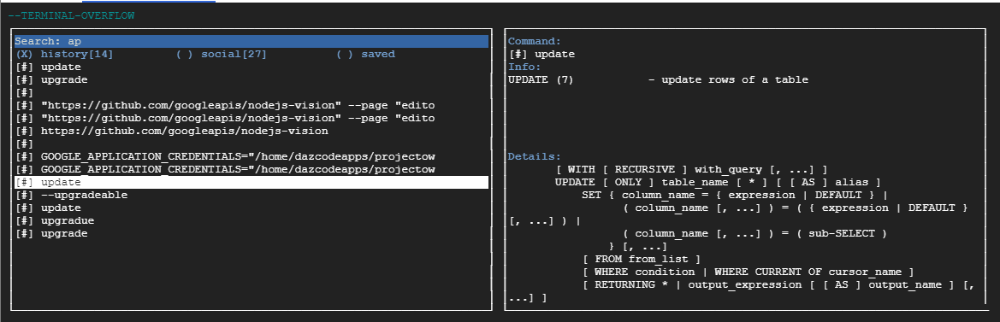

* Pre-release for concept purposes only! Does not fully work yet!

# Terminal-Overflow


The command line is a powerful tool, but is not very user friendly. This project will give you an edge and save you time when you need to find, put together, and run a command. Features:

* Visual Experience
* Mouse & keyboard navigation
* Customize and link helper containers to understand commands and options
* Leverage multiple command data sources: history, recommended, and saved commands
* Designed for use in terminals such as Google Cloud Console


<!--
<a href="https://terminaloverflow.com/framework/" target="_blank">Watch the video demo here (15 seconds).</a>
-->

## Content
* QuickStart
* Screenshot
* Contact Info

## Quick Start

1. **Install:**
  ```bash
  sudo pip install terminaloverflow
  ```
2. **Run:**
  ```bash
  terminaloverflow
  ```

## Screenshot


## Contact

David Zentner dazcode@gmail.com